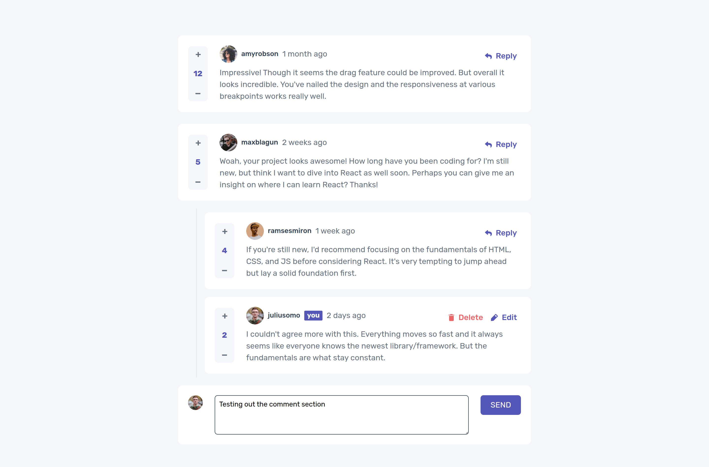

# Frontend Mentor - Interactive comments section solution

This is a solution to the [Interactive comments section challenge on Frontend Mentor](https://www.frontendmentor.io/challenges/interactive-comments-section-iG1RugEG9). Frontend Mentor challenges help you improve your coding skills by building realistic projects.

## Table of contents

- [Overview](#overview)
  - [The challenge](#the-challenge)
  - [Screenshot](#screenshot)
  - [Links](#links)
- [My process](#my-process)
  - [Built with](#built-with)
  - [What I learned](#what-i-learned)
  - [Continued development](#continued-development)
- [Author](#author)
- [Acknowledgments](#acknowledgments)

## Overview

### The challenge

Users should be able to:

- View the optimal layout for the app depending on their device's screen size
- See hover states for all interactive elements on the page
- Create, Read, Update, and Delete comments and replies
- Upvote and downvote comments
- **Bonus**: If you're building a purely front-end project, use `localStorage` to save the current state in the browser that persists when the browser is refreshed.
- **Bonus**: Instead of using the `createdAt` strings from the `data.json` file, try using timestamps and dynamically track the time since the comment or reply was posted.

### Screenshot

### Links

- Live Site URL: [interactive-comment-section](https://frontendmentor-interactive-comment-section-astraldev.vercel.app)

## My process

### Built with

- [VueJS](http://vuejs.org)
- [TailwindCSS](http://tailwindcss.com)
- [Vite Bundler](http://vitejs.dev)

### What I learned

I kinda learnt a lot here based on state management.. 

1. Always create a new array when dealing with arrays in VueJS | ReactJS | any other framework
2. Nominalise using props and emit. Don't try changing the state yourself.
3. First time working with localStorage.
4. Avoid using watch all the time. Can cause issues

### Continued development

I would like to add a date formatter and animations.

## Author

- Frontend Mentor - [@astraldev](https://www.frontendmentor.io/profile/astraldev)
- Twitter - [@ekureedem](https://www.twitter.com/ekureedem)

## Acknowledgments

This was a solo project.
